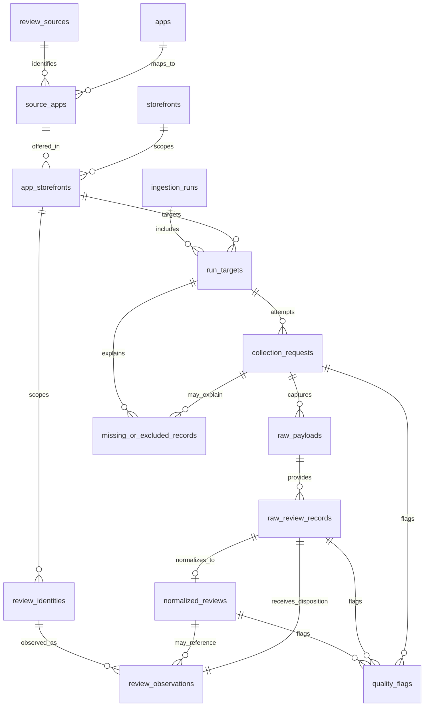

# Database Schema Design

## Purpose

This stage defines the PostgreSQL schema and an explicitly invoked controlled backfill path for preserved validation evidence. The live collectors still write CSV, JSON, JSONL, raw payload, report, and EDA artifacts; they do not write to PostgreSQL during collection.

The schema is designed to preserve both successful review data and unsuccessful collection evidence. Apple App Store remains the primary source. Google Play remains a secondary benchmark, with the current limitation that the `google-play-scraper` wrapper does not expose complete HTTP-level request evidence.

The design supports:

- app metadata
- source-specific app identifiers
- storefront and language context
- ingestion runs and per-target run status
- request-level and page-level evidence
- raw payload storage references and JSONB snapshots
- raw review records
- normalized review records
- conservative duplicate identity and repeated-observation handling
- missing or excluded records
- quality flags
- source limitations, failed requests, empty pages, pagination limits, and stop reasons

## Technology Choice

The target database is PostgreSQL. PostgreSQL is appropriate because the project needs relational integrity for runs, requests, apps, storefronts, raw records, normalized records, and duplicate observations while also needing flexible `jsonb` columns for variable source payloads and metadata. PostgreSQL indexes support the expected audit queries over app/storefront/page/run status, review dates, hashes, duplicate identities, and quality flags.

The proposed implementation path uses SQLAlchemy and Alembic. This stage includes PostgreSQL DDL in [db/schema.sql](../db/schema.sql) and an initial Alembic migration in [alembic/versions/0001_initial_review_ingestion_schema.py](../alembic/versions/0001_initial_review_ingestion_schema.py). Future pipeline persistence should add SQLAlchemy models or repository helpers around this schema.

## ERD



## Table Definitions

### `review_sources`

Catalog of review sources.

| Column | Type | Constraints | Purpose |
| --- | --- | --- | --- |
| `source_id` | `uuid` | primary key | Internal source key. |
| `source_code` | `text` | unique, non-empty | Stable code such as `apple_app_store` or `google_play`. |
| `display_name` | `text` | not null | Human-readable source name. |
| `priority` | `integer` | not null | Ordering; Apple should have stronger priority than Google Play. |
| `access_method` | `text` | nullable | Source access path, such as Apple customer reviews RSS. |
| `access_method_type` | `text` | nullable | Classification such as publicly accessible undocumented feed. |
| `is_primary` | `boolean` | not null | Marks Apple App Store as primary. |
| `limitations` | `text[]` | not null | Known source limitations. |
| `created_at` | `timestamptz` | not null | Creation timestamp. |

### `apps`

Canonical app/product entity independent of source.

| Column | Type | Constraints | Purpose |
| --- | --- | --- | --- |
| `app_id` | `uuid` | primary key | Internal app key. |
| `canonical_name` | `text` | non-empty | App name, such as YouTube. |
| `category` | `text` | nullable | Optional category used in validation targets. |
| `created_at` | `timestamptz` | not null | Creation timestamp. |

Index: `ix_apps_canonical_name`.

### `source_apps`

Source-specific app identifiers.

| Column | Type | Constraints | Purpose |
| --- | --- | --- | --- |
| `source_app_id` | `uuid` | primary key | Internal source-app key. |
| `app_id` | `uuid` | foreign key | References `apps`. |
| `source_app_identifier` | `text` | non-empty | Apple app ID or Google package ID. |
| `source_url` | `text` | nullable | App details URL when known. |
| `metadata` | `jsonb` | not null | Source-specific app metadata. |
| `created_at` | `timestamptz` | not null | Creation timestamp. |

Unique constraint: `(source_id, source_app_identifier)`.

### `storefronts`

Country/language storefront dimension.

| Column | Type | Constraints | Purpose |
| --- | --- | --- | --- |
| `storefront_id` | `uuid` | primary key | Internal storefront key. |
| `country_code` | `text` | lowercase | Country/storefront code, such as `us` or `gb`. |
| `language_code` | `text` | lowercase | Request language, such as `en`. |
| `storefront_name` | `text` | nullable | Optional display label. |
| `created_at` | `timestamptz` | not null | Creation timestamp. |

Unique constraint: `(country_code, language_code)`.

### `app_storefronts`

Source app plus storefront context. This is intentionally part of review identity to avoid assuming source review IDs are globally unique.

| Column | Type | Constraints | Purpose |
| --- | --- | --- | --- |
| `app_storefront_id` | `uuid` | primary key | Internal app/storefront key. |
| `source_app_id` | `uuid` | foreign key | References `source_apps`. |
| `storefront_id` | `uuid` | foreign key | References `storefronts`. |
| `configured_category` | `text` | nullable | Category configured for validation target. |
| `created_at` | `timestamptz` | not null | Creation timestamp. |

Unique constraint: `(source_app_id, storefront_id)`.

### `ingestion_runs`

One invocation or backfilled historical run.

| Column | Type | Constraints | Purpose |
| --- | --- | --- | --- |
| `run_id` | `uuid` | primary key | Internal run key. |
| `external_run_name` | `text` | unique nullable | Run ID such as `apple-large-10000`. |
| `phase` | `text` | not null | Assessment phase. |
| `started_at` | `timestamptz` | not null | Start timestamp. |
| `completed_at` | `timestamptz` | nullable | Completion timestamp. |
| `status` | `text` | enum-like check | `running`, `completed`, `partial`, `failed`, or `skipped`. |
| `target_review_count` | `integer` | non-negative nullable | Configured target. |
| `reviews_collected` | `integer` | non-negative | Final collected count. |
| `target_reached` | `boolean` | nullable | Whether target was met. |
| `stop_reason` | `text` | nullable | Overall reason collection stopped. |
| `config` | `jsonb` | not null | Sanitized config snapshot. |
| `code_version` | `text` | nullable | Git SHA or version. |
| `processed_output_path` | `text` | nullable | Historical processed file path. |
| `reports_output_path` | `text` | nullable | Historical reports path. |
| `raw_output_path` | `text` | nullable | Historical raw output path. |

Indexes: `started_at`, `status`.

### `run_targets`

One app/storefront target within a run.

| Column | Type | Constraints | Purpose |
| --- | --- | --- | --- |
| `run_target_id` | `uuid` | primary key | Internal target key. |
| `run_id` | `uuid` | foreign key | References `ingestion_runs`. |
| `app_storefront_id` | `uuid` | foreign key | References `app_storefronts`. |
| `target_review_count` | `integer` | non-negative nullable | Target for this app/storefront. |
| `max_pages` | `integer` | positive nullable | Configured page cap. |
| `reviews_collected` | `integer` | non-negative | Collected count for target. |
| `status` | `text` | not null | Target status. |
| `stop_reason` | `text` | nullable | Target-specific stop reason. |
| `created_at` | `timestamptz` | not null | Creation timestamp. |

Unique constraint: `(run_id, app_storefront_id)`.

### `collection_requests`

One request, page, or wrapper batch attempt. This table preserves failed and empty evidence even when no review rows are created.

| Column | Type | Constraints | Purpose |
| --- | --- | --- | --- |
| `request_id` | `uuid` | primary key | Internal request key. |
| `run_target_id` | `uuid` | foreign key | References `run_targets`. |
| `source_id` | `uuid` | foreign key | References `review_sources`. |
| `request_sequence` | `integer` | positive | Ordered sequence within target. |
| `page_number` | `integer` | positive nullable | Apple RSS page number. |
| `batch_number` | `integer` | positive nullable | Google Play wrapper batch. |
| `cursor_in` | `text` | nullable | Input cursor/token when available. |
| `cursor_out` | `text` | nullable | Output cursor/token when available. |
| `request_url` | `text` | not null | Scrubbed or full source URL per policy. |
| `request_method` | `text` | not null | Usually `GET`. |
| `requested_at` | `timestamptz` | not null | Request start timestamp. |
| `completed_at` | `timestamptz` | nullable | Request completion timestamp. |
| `elapsed_seconds` | `numeric(12,6)` | non-negative nullable | Request duration. |
| `http_status_code` | `integer` | 100-599 nullable | HTTP status when available. |
| `success` | `boolean` | not null | Whether collection request succeeded. |
| `blocked` | `boolean` | not null | 401/403/429 or equivalent. |
| `content_type` | `text` | nullable | Response content type. |
| `response_size_bytes` | `integer` | non-negative nullable | Response size. |
| `error_type` | `text` | nullable | Error class/category. |
| `error_message` | `text` | nullable | Error detail. |
| `status_category` | `text` | enum-like check | `ok`, `empty_page`, `request_failed`, `pagination_limit_or_unavailable_page`, `json_parse_error`, `target_limit_not_reached`, `wrapper_evidence_incomplete`, or `skipped`. |
| `raw_review_count` | `integer` | non-negative | Raw reviews parsed from response. |
| `distinct_review_count` | `integer` | non-negative | Distinct IDs on page/batch. |
| `distinct_from_previous_page` | `boolean` | nullable | Pagination uniqueness check. |
| `created_at` | `timestamptz` | not null | Creation timestamp. |

Indexes support failed-request queries, page-depth analysis, status-category filtering, and run-target sequencing.

### `raw_payloads`

Raw source payload captured for one request.

| Column | Type | Constraints | Purpose |
| --- | --- | --- | --- |
| `payload_id` | `uuid` | primary key | Internal payload key. |
| `request_id` | `uuid` | foreign key | References `collection_requests`. |
| `storage_path` | `text` | nullable | Filesystem path for raw JSON payload. |
| `payload_sha256` | `text` | indexed 64-char hex | Hash of raw bytes; identical content may occur on multiple requests. |
| `payload_json` | `jsonb` | nullable | Database JSONB snapshot. |
| `captured_at` | `timestamptz` | not null | Capture timestamp. |
| `created_at` | `timestamptz` | not null | Creation timestamp. |

At least one of `storage_path` or `payload_json` must be present. Future persistence should usually store both. Filesystem storage preserves exact raw artifacts and keeps parity with current validation outputs. `jsonb` supports direct inspection and backfill QA. The hash verifies that the database JSONB/storage reference still matches the captured payload.

### `raw_review_records`

Individual raw entries extracted from a payload.

| Column | Type | Constraints | Purpose |
| --- | --- | --- | --- |
| `raw_record_id` | `uuid` | primary key | Internal raw-record key. |
| `payload_id` | `uuid` | foreign key, not null | References the specific request-owned `raw_payloads` occurrence. |
| `source_review_id` | `text` | nullable | Raw source review ID if present. |
| `record_ordinal` | `integer` | non-negative | Position in payload. |
| `raw_record_json` | `jsonb` | not null | Raw entry JSON. |
| `raw_record_sha256` | `text` | 64-char hex | Hash of raw entry. |
| `parse_status` | `text` | enum-like check | `parsed`, `excluded`, `parse_error`, or `non_review_entry`. |
| `parse_error` | `text` | nullable | Parse error detail. |
| `created_at` | `timestamptz` | not null | Creation timestamp. |

Unique constraint: `(payload_id, record_ordinal)`.

### `normalized_reviews`

Source-neutral normalized review row derived from exactly one raw record.

| Column | Type | Constraints | Purpose |
| --- | --- | --- | --- |
| `normalized_review_id` | `uuid` | primary key | Internal normalized review key. |
| `raw_record_id` | `uuid` | unique foreign key | References `raw_review_records`. |
| `source_review_id` | `text` | nullable | Normalized review ID. |
| `review_title` | `text` | nullable | Apple title when available. |
| `review_text` | `text` | nullable | Review text. |
| `rating` | `numeric(3,1)` | 0-5 nullable | Star rating. |
| `review_date` | `timestamptz` | nullable | Source review timestamp. |
| `author_id` | `text` | nullable | Source author ID when available. |
| `author_name` | `text` | nullable | Source author name. |
| `helpful_votes` | `integer` | non-negative nullable | Helpful/vote sum. |
| `app_version` | `text` | nullable | Reviewed app version. |
| `developer_response` | `text` | nullable | Google Play field when available. |
| `developer_response_date` | `timestamptz` | nullable | Response date. |
| `source_url` | `text` | nullable | Review/request URL. |
| `raw_page_number` | `integer` | positive nullable | Apple page number. |
| `raw_cursor` | `text` | nullable | Google Play cursor/token if available. |
| `collected_at` | `timestamptz` | not null | Collection timestamp. |
| `normalized_json` | `jsonb` | not null | Full normalized row snapshot. |
| `normalized_hash` | `text` | 64-char hex | Hash of canonical normalized row. |
| `created_at` | `timestamptz` | not null | Creation timestamp. |

Indexes: `review_date`, `source_review_id`, and `normalized_hash`. Run, source, app, and storefront are derived through the raw lineage rather than copied here.

### `review_identities`

Conservative duplicate identity.

The identity is `(app_storefront_id, source_review_id)`. The app/storefront already determines its source through `source_apps`, avoiding a redundant source field while retaining source/app/storefront context.

| Column | Type | Constraints | Purpose |
| --- | --- | --- | --- |
| `review_identity_id` | `uuid` | primary key | Internal identity key. |
| `app_storefront_id` | `uuid` | foreign key | App/storefront scope. |
| `source_review_id` | `text` | non-empty | Source review ID. |
| `first_seen_at` | `timestamptz` | not null | First observation time. |
| `latest_seen_at` | `timestamptz` | not null | Latest observation time. |
| `created_at` | `timestamptz` | not null | Creation timestamp. |

Unique constraint: `(app_storefront_id, source_review_id)`.

### `review_observations`

Every time an identity appears in a run/request.

| Column | Type | Constraints | Purpose |
| --- | --- | --- | --- |
| `observation_id` | `uuid` | primary key | Internal observation key. |
| `review_identity_id` | `uuid` | nullable foreign key | References identity when a usable source review ID exists. |
| `raw_record_id` | `uuid` | unique foreign key | Exact raw occurrence receiving this disposition. |
| `normalized_review_id` | `uuid` | nullable foreign key | References normalized row if retained. |
| `observation_status` | `text` | enum-like check | `new`, `repeat_seen`, `duplicate_skipped`, `excluded`, `parse_error`, or `non_review_entry`. |
| `observed_at` | `timestamptz` | not null | Observation timestamp. |
| `created_at` | `timestamptz` | not null | Creation timestamp. |

This supports duplicate and rerun analysis while preserving skipped repeats and records without usable IDs. A trigger verifies that identity context and normalized lineage match the raw record.

### `quality_flags`

Review-, raw-record-, or request-level quality annotations.

| Column | Type | Constraints | Purpose |
| --- | --- | --- | --- |
| `quality_flag_id` | `uuid` | primary key | Internal flag key. |
| `normalized_review_id` | `uuid` | nullable foreign key | Review-level subject. |
| `raw_record_id` | `uuid` | nullable foreign key | Raw-record subject. |
| `request_id` | `uuid` | nullable foreign key | Request-level subject. |
| `flag_type` | `text` | not null | Example: `low_signal_text`, `missing_review_date`, `empty_page`. |
| `severity` | `text` | check | `info`, `warning`, or `error`. |
| `flag_value` | `jsonb` | not null | Structured details. |
| `created_at` | `timestamptz` | not null | Creation timestamp. |

Exactly one subject foreign key is required.

### `missing_or_excluded_records`

Target or request evidence for records that were expected, missing, unavailable, skipped, or excluded.

| Column | Type | Constraints | Purpose |
| --- | --- | --- | --- |
| `missing_record_id` | `uuid` | primary key | Internal key. |
| `run_target_id` | `uuid` | foreign key | Target context. |
| `request_id` | `uuid` | nullable foreign key | Request context if applicable. |
| `reason_code` | `text` | not null | Example: `target_limit_not_reached`, `empty_page`, `duplicate_skipped`. |
| `reason_detail` | `text` | nullable | Human-readable detail. |
| `expected_count` | `integer` | non-negative nullable | Configured or expected count. |
| `observed_count` | `integer` | non-negative nullable | Actual observed count. |
| `source_context` | `jsonb` | not null | App, storefront, page, and source-specific context. |
| `created_at` | `timestamptz` | not null | Creation timestamp. |

## Raw-to-Normalized Traceability

Traceability is explicit:

```text
ingestion_runs
  -> run_targets
  -> collection_requests
  -> raw_payloads
  -> raw_review_records
  -> normalized_reviews
```

`collection_requests` records every page/batch attempt, including failures and empty pages. Each `raw_payloads` row belongs to one request; hashes are indexed but not globally unique because identical content can be observed repeatedly. `(payload_id, record_ordinal)` identifies an exact raw entry. `normalized_reviews.raw_record_id` selects the retained first-seen occurrence.

## Duplicate And Rerun Handling

Duplicate identity is conservative: `(app_storefront_id, source_review_id)`, with source implied by the app/storefront.

This means the same numeric or string review ID in two different apps, sources, countries, or languages is not automatically treated as the same review. Every appearance is stored in `review_observations`. If a repeated review ID is skipped from the final normalized dataset, the skipped observation is still retained with `observation_status = 'duplicate_skipped'`.

The Apple backfill orders payloads by capture timestamp and entries by original feed ordinal. The first appearance within `(source, app, country, language, source_review_id)` receives the normalized row; later appearances receive `duplicate_skipped`. Run and request are derived through each observation's raw-record lineage.

## Failed Requests, Empty Pages, And Pagination Limits

`collection_requests.status_category` is the central field for request/page outcomes:

- `ok`: request returned parseable review records
- `empty_page`: request succeeded but no review entries were returned
- `request_failed`: request failed or no response was available
- `pagination_limit_or_unavailable_page`: later page returned unavailable evidence such as 400 or 404
- `json_parse_error`: response could not be parsed as expected JSON
- `target_limit_not_reached`: synthetic or target-level evidence that the configured target was not reached
- `wrapper_evidence_incomplete`: useful for Google Play wrapper batches where HTTP status/headers are not exposed
- `skipped`: configured target/source was not attempted

Run-level and target-level `stop_reason` fields preserve why collection stopped before configured target counts were reached.

## Historical Backfill

The controlled loader creates an `ingestion_runs` row for each explicitly selected validation run folder, one `run_targets` row per app/storefront, one `collection_requests` row per pagination CSV entry, one `raw_payloads` row per raw JSON file where available, and normalized/raw review rows from the existing validation CSV/JSONL. It can load the current 6,396-review validation run after the small validation run succeeds; no database load occurs implicitly.

## Source Limitation Notes

Apple App Store request evidence can include HTTP status, response size, content type, page number, raw review count, empty pages, unavailable pages, and raw payload files. Google Play currently provides normalized records, batch/cursor evidence, and wrapper-level errors, but not complete HTTP status/header evidence because the current access path uses an unofficial third-party wrapper.
